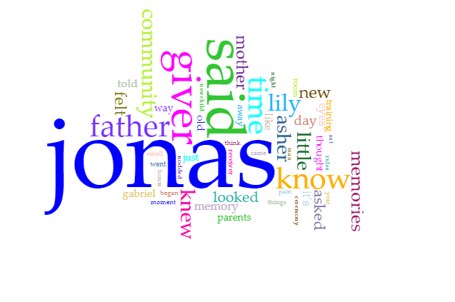
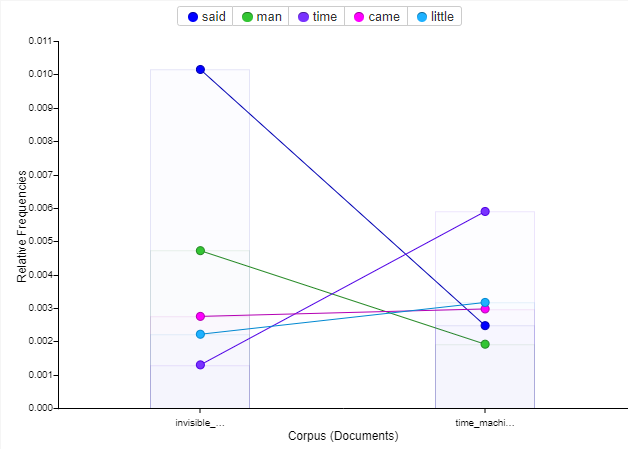

# Voyant as a tool

##### Voyant is a web-based reading and analysis environment for digital texts.  
This tool can deconstruct and visualize text data from one or more sources allowing you to better understand the content and connections within the data.  For example if you were to take the book [The Giver][giver] and run it through Voayant you would get helpful deconstructions of that text.  

Below you can see a Cirrus of the most used words in [The Giver][giver].  This can help you discover themes in the text.

This however is just the tip of the iceberg when it comes to the uses of Voyant.  Its real power comes when two or more texts are entered into the corpus.

If we take two texts such as [The Invisible Man][invisible_man] and [The Time Machine][time_machine] by H.G.Wells and input them as our corpus then Voyant will break both down and give us stats based on both in relation to each other.  

[time_machine]: time_machine_text.txt "The Time Machine"
[invisible_man]: invisible_man_text.txt "The Invisible Man"
[giver]: thegiver.pdf "The Giver"
