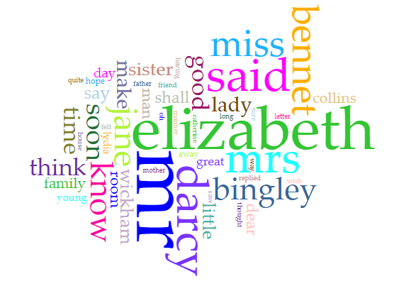
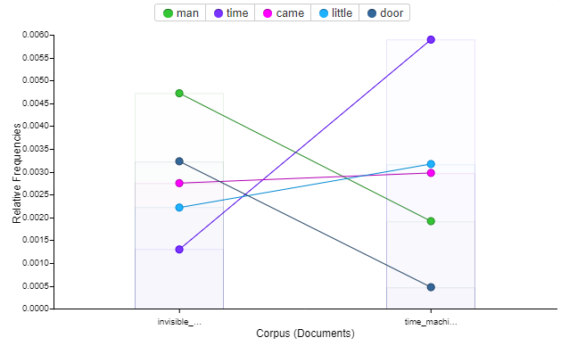
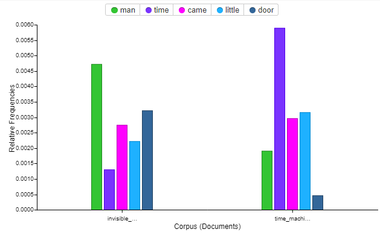

 
[@brock_dsl](https://twitter.com/brock_dsl)

# Voyant as a tool

##### Voyant is a web-based reading and analysis environment for digital texts.  
This tool can deconstruct and visualize text data from one or more sources allowing you to better understand the content and connections within the data.  For example if you were to take the book [Pride and Prejudice][pride] and run it through Voayant you would get helpful deconstructions of that text.  

Below you can see a Cirrus of the most used words in [Pride and Prejudice][pride].  This can help you discover themes in the text.

This however is just the tip of the iceberg when it comes to the uses of Voyant.  Its real power comes when two or more texts are entered into the corpus.

If we take two texts such as [The Invisible Man][invisible_man] and [The Time Machine][time_machine] by H.G.Wells and input them as our corpus then Voyant will break both down and give us stats based on both in relation to each other.  

Here we have a chart comparing the frequency of the five most common words from these two texts.

Voyant allows for manipulation of what variables are compared as well so that  words like "said" in the chart above can be cut for more interesting and relevant words.  Below we have the same chart but the word "said" has been replaced with another common word.

The same data can be displayed in different forms as well so that different perspectives might give more insight into the relation between the texts.

These are of course just a few uses of Voyant.  This tool can also be used in art, advertising, and any other way you can think of!

[time_machine]: time_machine_text.txt "The Time Machine"
[invisible_man]: invisible_man_text.txt "The Invisible Man"
[pride]: pride_and_prejudice.txt "Pride and Prejudice"
